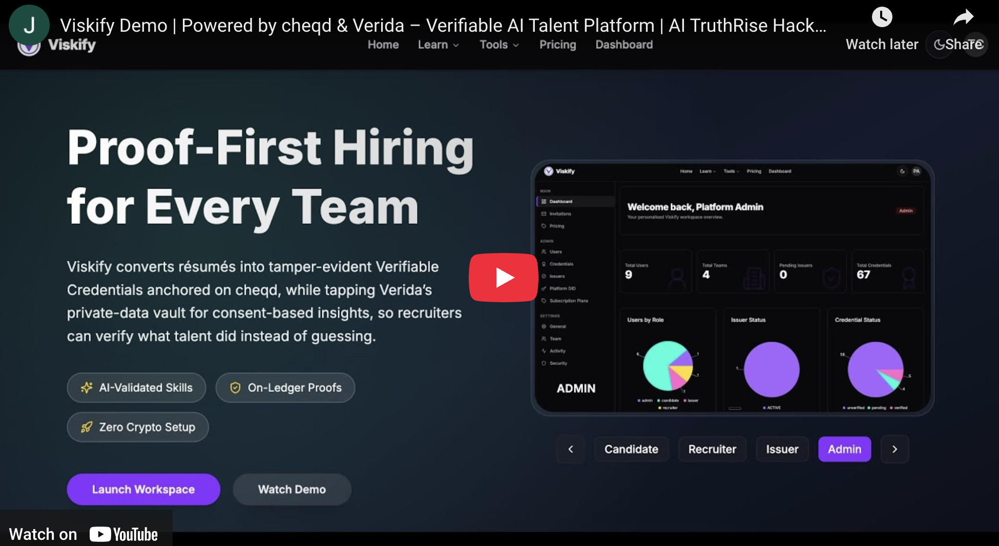

# Viskify — AI-Assisted Talent Verification powered by **cheqd**

_Verifiable Credentials, deterministic DIDs and usage-based billing with zero smart-contract deployment._

[](https://youtu.be/demo-placeholder)

---

## ✨ Why Viskify?

- **did:cheqd identities** — every Team and Issuer provisions a deterministic `did:cheqd:…` via Cheqd Studio’s `/did/create` endpoint; those DIDs become the subjects for all future credentials.
- **Verifiable Credentials (VC-JWT)** — credentials are issued and verified through Cheqd Studio’s `/credential/issue` and `/credential/verify` APIs, then persisted in Postgres for instant retrieval.
- **Web-2 integration** — the platform talks to Cheqd over HTTPS; no wallets, RPC nodes or Solidity required.
- **Stripe Billing** — subscription & metered verification charges are handled through Stripe Checkout and Billing.
- **Freemium Pricing** — unlimited personal usage — pay only for advanced team features.

## 🔒 Verida Private Data Agent

Viskify now super-charges talent verification with **Verida’s encrypted data network**:

- **One-tap Vault Connect** – candidates authenticate via the Verida mobile wallet; tokens and granted scopes are securely stored server-side.
- **Consent-driven Data Access** – Telegram, Gmail and other connectors are queried only after explicit user approval, satisfying the hackathon’s _user-owned data_ requirement.
- **LLM Insights on Private Data** – a server-side call to `/llm/agent` distills the candidate’s Telegram messages into JSON insights that recruiters can action instantly.
- **Provider Snapshot & Audit** – authorised connectors are mirrored to Postgres (`verida_connections`), enabling recruiter filters and off-chain audits.
- **Granular Revocation** – users can disconnect at any time; a single POST to `/api/verida/disconnect` purges tokens and snapshots.

> **Hackathon Alignment**: This implementation demonstrates deliberate Verida API usage, consent-checked private-data access, secure token handling, and verifiable agentic output – directly mapping to the _Build an Agent incorporating Private User Data_ bounty.

---

## 🚀 Quick Start

1. **Clone & install**

   ```bash
   git clone https://github.com/syntaxsurge/viskify-cheqd.git
   cd viskify-cheqd
   pnpm install
   ```

2. **Environment files**

   ```bash
   cp .env.example .env
   ```

   Minimum variables:

   | Key                                   | Purpose                                                                                                  |
   | ------------------------------------- | -------------------------------------------------------------------------------------------------------- |
   | `POSTGRES_URL`                        | PostgreSQL connection string                                                                             |
   | `CHEQD_API_URL`                       | Cheqd Studio base URL (e.g. `https://studio.cheqd.io`)                                                   |
   | `CHEQD_API_KEY`                       | Cheqd Studio API key                                                                                     |
   | `OPENAI_API_KEY`                      | GPT-4o key for AI workflows                                                                              |
   | `NEXT_PUBLIC_PLATFORM_ISSUER_DID`     | cheqd DID used by the platform issuer                                                                    |
   | `NEXT_PUBLIC_VERIDA_API_URL`          | Verida REST base URL (e.g. `https://api.verida.ai/api/rest`)                                             |
   | `NEXT_PUBLIC_VERIDA_API_VERSION`      | Verida REST API version segment (default: `v1`)                                                          |
   | `NEXT_PUBLIC_VERIDA_AUTH_URL`         | Verida Vault authentication URL (e.g. `https://app.verida.ai`)                                           |
   | `NEXT_PUBLIC_VERIDA_APP_DID`          | DID identifier of the Viskify application registered with Verida                                         |
   | `NEXT_PUBLIC_VERIDA_DEFAULT_SCOPES`   | Comma-separated list of Verida scopes requested during connect flow                                      |
   | `NEXT_PUBLIC_VERIDA_APP_REDIRECT_URL` | OAuth callback URL pointing to `/api/verida/callback` (e.g. `http://localhost:3000/api/verida/callback`) |

3. **Database setup (optional Docker helper)**

   ```bash
   docker compose up -d database   # Postgres 16 on :54322
   pnpm db:reset                   # runs migrations & seeds demo data
   ```

4. **Launch Viskify**

   ```bash
   pnpm dev
   ```

   Open <http://localhost:3000>.

---

## 🖥 User-Journey Snapshot

### Candidate

- One-click DID creation through Cheqd Studio — no wallet needed.
- Upload credentials → UNVERIFIED · PENDING · VERIFIED/REJECTED lifecycle.
- AI-graded skill-checks; a passing score automatically mints a cheqd VC.

### Issuer

- Self-service onboarding with admin approval.
- Approve / Reject verification requests — approval signs a Verifiable Credential via Cheqd Studio.

### Recruiter

- Full-text talent search with verified-only toggle.
- Kanban pipelines, AI fit-summaries cached per recruiter × candidate.

### Admin

- Issuer approvals, role upgrades, credential revocation.
- Platform DID rotation and pricing updates, all through Cheqd APIs.

---

## 🧑‍💻 Architecture at a Glance

| Layer       | Stack                                                               |
| ----------- | ------------------------------------------------------------------- |
| Frontend    | Next.js 14 (App Router), React Server / Client Components           |
| Backend     | PostgreSQL via Drizzle ORM, Edge runtime middleware, server actions |
| Trust layer | Cheqd Studio APIs for DID creation, VC issuance & verification      |
| Billing     | Stripe Billing for subscriptions & metered verification fees        |
| AI          | OpenAI GPT-4o for grading, summarisation and fit analysis           |

---

## 🧠 AI Usage and Prompts

### How AI Tools Were Used

Viskify integrates OpenAI GPT-4o in three independent workflows:

| Feature                                                                                                              | File(s) / Entry Point                                                                                                                                       | Model Interaction                                                                  | Guard-rails & Caching                                                                                                                                                                          |
| -------------------------------------------------------------------------------------------------------------------- | ----------------------------------------------------------------------------------------------------------------------------------------------------------- | ---------------------------------------------------------------------------------- | ---------------------------------------------------------------------------------------------------------------------------------------------------------------------------------------------- |
| **Strict Quiz Grader** – grades free-text answers and converts them to a 0-100 score used by candidate Skill Passes. | `lib/ai/openai.ts ➜ openAIAssess()`<br/>`lib/ai/prompts.ts ➜ strictGraderMessages()`<br/>`lib/ai/validators.ts ➜ validateQuizScoreResponse()`               | Non-streaming chat completion with automatic validation & up to **3 retries**.     | Centralised validator guarantees a 0-100 integer and `chatCompletion()` automatically retries three times before throwing.                                                                     |
| **Candidate Profile Summary** – produces a 120-word third-person bio shown on public profiles.                       | `lib/ai/openai.ts ➜ summariseCandidateProfile()`<br/>`lib/ai/prompts.ts ➜ summariseProfileMessages()`                                                       | Single-shot chat completion.                                                       | SHA-256 hash of bio + credential list prevents duplicate generations; server limits to **2 runs per UTC day**.                                                                                 |
| **"Why Hire" Fit Summary** – recruiter-specific JSON (five 12-word bullets, bestPipeline, pros/cons).                | `lib/ai/openai.ts ➜ generateCandidateFitSummary()`<br/>`lib/ai/prompts.ts ➜ candidateFitMessages()`<br/>`lib/ai/validators.ts ➜ validateCandidateFitJson()` | Non-streaming chat completion with automatic validation & up to **3 retries**.     | Centralised validator auto-parses JSON, enforces schema, and `chatCompletion()` retries three times before error; results cached per recruiter × candidate (`recruiter_candidate_fits` table). |
| **Telegram Insights** – synthesises key themes from private Telegram messages via Verida LLM Agent.                  | `lib/ai/openai.ts ➜ generateTelegramInsights()`<br/>`lib/ai/prompts.ts ➜ telegramInsightsPrompt()`                                                          | Server-side call to Verida `/llm/agent` endpoint then single-shot OpenAI analysis. | Invoked on demand; output trimmed to **1000 chars**, cached in component state; errors surfaced via toast for graceful UX.                                                                     |

### AI Prompt & Usage Summary

#### Exact Prompts

<pre>
— Strict Grader (system) —
You are a strict exam grader. Respond ONLY with an integer 0-100.

— Strict Grader (user) —
Quiz topic: {{quizTitle}}
Candidate answer: {{answer}}
Grade (0-100):

— Profile Summary (system) —
Summarise the following candidate profile in approximately {{words}} words. Write in third-person professional tone without using personal pronouns.

— Profile Summary (user) —
{{rawCandidateProfile}}

— Recruiter Fit (system) —
You are an elite technical recruiter assistant with deep knowledge of skill
match-making, talent branding and concise executive communication.  Follow ALL rules
strictly:
• Think step-by-step but output *only* the final JSON (no markdown, no commentary).
• Each "bullets" item MUST contain exactly 12 words; start with an action verb.
• Use the recruiter’s pipelines to choose "bestPipeline"; if none fit, return "NONE".
• Focus on evidence from credentials/bio; do not invent facts.
• Obey the output schema below verbatim.

— Recruiter Fit (user) —
=== Recruiter Pipelines (max 20) ===
{{numberedPipelineList}}

=== Candidate Profile ===
{{candidateProfile}}

Return the JSON now:
</pre>

#### Iterative Prompt Improvements

- **Strict Grader** – tightened to enforce a single integer after early experiments returned explanations.
- **Profile Summary** – reduced word budget and switched to third-person to avoid "I have…" phrasing.
- **Fit Summary** – added in-prompt JSON schema, 12-word bullet constraint and a validation-with-retry loop to guarantee compliant output.

## 🏆 Hackathon Submission Checklist

- **Unique Use-Case** – Fuses on-ledger cheqd proofs with consent-based private data from Verida vaults for holistic talent verification.
- **cheqd Capability Implementation** – Deterministic DID creation, VC-JWT issuance/verification, Trust Registry entries, DID-Linked Resources, fee-abstracted payments.
- **Verida Capability Implementation** – OAuth Vault flow, Universal & Datastore Search, LLM Agent, granular scope management, token revocation.
- **Why cheqd + Verida** – cheqd anchors public trust while Verida supplies user-owned private signals, satisfying tracks on agentic economy, content credentials and verified datasets.
- **3-Minute Demo Video** – See header link or `demo.mp4`.
- **Public Repo** – <https://github.com/syntaxsurge/viskify-cheqd>

## 🎯 Judging Criteria Mapping

| Criterion                   | Implementation Highlights                                                                        |
| --------------------------- | ------------------------------------------------------------------------------------------------ |
| **Technical Excellence 40** | Typed Next.js 14, Drizzle ORM, Jest suite, CI-linted; end-to-end Verida & cheqd wrappers.        |
| **cheqd Capability 30**     | DID creation, VC-JWT issuance/verification, Trust Registry, DLR logos, payment-gated revocation. |
| **Innovation & Impact 30**  | First platform merging verifiable proofs with behavioural chat insights via Verida AI agent.     |
| **Business Viability 15**   | Freemium SaaS with subscription + metered verifications; zero on-chain gas for users.            |
| **Presentation 10**         | Polished landing, video demo, interactive dashboards, clear README.                              |
| **Bonus 5**                 | Implements full Verida private-data agent matching bounty theme.                                 |

---
